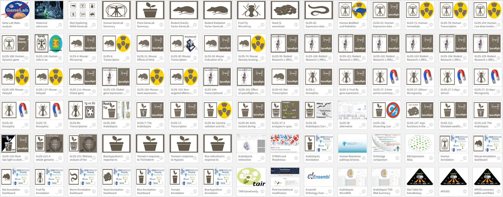

# Ara-Human-Astronaut-Qlik application

Link to app overview: [XKINGDOM (11) (Gravity-Ara-Human-Astronaut)](https://gilroy-qlik.botany.wisc.edu/a/sense/app/77aa616d-8f7d-489c-8501-4196aa731d0d)

<figure><figcaption>
There are many studies that can be merged from the OSDR. 
</figcaption></figure>

**Output Notes:**

Embedding Interactive Analyses in Digital Platforms: Enhancing Reports and Webpages

In the modern digital landscape, presenting data in interactive formats has become increasingly essential to engage and inform stakeholders effectively. Our platform enables users to export interactive analyses with applied filters for embedding into digital documents, reports, and websites, thereby enhancing the communicative value of these mediums.

For instance, consider the integration of an analysis sheet, identified by the sheet ID `sheet/34d94e76-40e0-4c4a-a338-1f113fa39470/state/analysis`, into a report or website. This process is facilitated through our application, identified by the APP ID `77aa616d-8f7d-489c-8501-4196aa731d0d`.

The target application can be accessed directly via the server link: `/app/77aa616d-8f7d-489c-8501-4196aa731d0d`. For a comprehensive overview of the application and its features, one may visit [https://gilroy-qlik.botany.wisc.edu/a/sense](https://gilroy-qlik.botany.wisc.edu/a/sense).

By embedding interactive sheets into digital platforms, users can provide stakeholders with a dynamic and immersive data exploration experience, directly within the context of the digital content being delivered. This integration streamlines the information dissemination process, allowing for more engaging and informative presentations of data analytics.

.png>)

