# NPJ plan / template Xspecies  Empire2

[**https://www.nature.com/npjmgrav/**](https://www.nature.com/npjmgrav/)

**Cover letter - Good Luck! :-)**

### [**Article**](https://www.nature.com/npjmgrav/for-authors-and-referees/submission-guidelines#online-submission) 

**An Article is a substantial research study, with a complex story often involving several techniques or approaches. The main text (excluding abstract, Methods, references and figure legends) is typically no more than 4,000-4,500 words. The abstract is typically 150 words, unreferenced. Articles have up to 10 display items (figures and/or tables). An Introduction section is followed by sections headed Results, Discussion, Methods and Data Availability. Alternatively, authors may follow the IMRaD format and present the Methods prior to the Results section. The Results and Methods should be divided by topical subheadings; the Discussion may contain subheadings at the editors' discretion. As a guideline, Articles have around 60 references.**

Title. **GeneLab enabled Science Matrix**

Authors. ??

**Abstract**

Comparison of the genomes and KEGG pathways of 4 model organisms

Text length and formatting guide.

\~50 words,

unreferenced; main text of no more than 5,000 words and 10 display items (figures, tables).

**Introduction**

**Humans take plants in space**

Plants have been used in spaceflight missions for decades, both as a source of food for astronauts and as a way to study the effects of the space environment on living organisms. While plants are able to adapt to many different environments on Earth, the extreme conditions of space pose unique challenges for them. One of the major challenges for plants in space is the lack of gravity, which can cause changes in the way that plants grow and develop. Without the pull of gravity, plants may grow taller and thinner than they do on Earth, and their roots may not grow downward as they normally would. The lack of gravity can also cause changes in the way that plants transport water and nutrients, as well as the way that they respond to light and other stimuli. Another challenge for plants in space is the high levels of radiation present in the space environment. This radiation can damage plant cells and alter the way that plants grow and develop. Additionally, the extreme temperatures and low humidity of space can cause stress for plants, leading to changes in their metabolism and growth. Despite these challenges, plants have shown a remarkable ability to adapt to the space environment. Many plant species have been successfully grown in space, including lettuce, tomatoes, and peppers, and researchers are working to develop new types of plants that can thrive in space. In addition to providing food for astronauts, plants may also have important applications for air purification, water recycling, and waste management in space habitats.

**Human have taken many model organism and their genomes in space**

The ensemble genome archive allow comparison of the gene function of many different organisms, including humans, mice, _Arabidopsis thalianna_ (a small flowering plant), and fruit flies (_Drosophila melanogaster_). There are several approaches that can be used to compare the genomes of these organisms, including sequence alignment, gene expression analysis, and phylogenetic analysis. Sequence alignment involves comparing the nucleotide or amino acid sequences of two or more genomes to identify regions of similarity and difference. This can be done using a variety of software tools, such as BLAST (Basic Local Alignment Search Tool) or ClustalW. Phylogenetic analysis involves constructing a phylogenetic tree, which is a graphical representation of the evolutionary relationships between different organisms. This can be done by comparing the sequences of specific genes or proteins, or by using a combination of genetic and morphological data. Ensemble has created the compara orthology database allowing evolution linages and conserved sequences to find common response between different organisms.

**Genes and RNA in space**

Gene expression analysis involves studying the patterns of gene expression (i.e., which genes are turned on or off) in different organisms. This can be done using techniques such as microarrays or RNA sequencing (RNA-Seq). Comparing the genomes of different organisms can provide valuable insights into the evolutionary relationships between these organisms and help us understand the genetic basis of various traits and functions. Transcriptomic technologies are used to study the expression of genes at the RNA level and have been applied to a model organism during space flight or microgravity simulations. Some of the most commonly used transcriptomic technologies include microarray analysis, quantitative PCR (qPCR), and RNA sequencing. Microarrays allow researchers to simultaneously measure the expression of thousands of genes, while qPCR is used to measure the relative abundance of specific RNA molecules. RNA sequencing is a highly sensitive and accurate method for quantifying the expression of all genes in a sample. These technologies are used to study gene expression patterns and can provide valuable insights into a wide range of biological processes.

**Proteins, enzymes and biochemical reaction in space**

Life's foundation is built within a watery environment. Water (H2O) itself is not just a solvent, but a vital player, providing the medium for all the intricate biochemical reactions happening inside cells. However, these reactions also generate byproducts called reactive oxygen species (ROS) like hydrogen peroxide (H2O2) and hydroxyl radicals (OH-). These ROS, with their equation (H2O + H2O2 + OH^- + protons), can damage cellular components, but they also have a surprising role in cellular signaling. DNA and RNA, the blueprints of life, are another crucial building block. These complex molecules, with their composition (Nucleic acid (DNA/RNA) +/- Phosphates), encode the genetic information that determines an organism's traits. Phosphates within their structure are essential for both their stability and their role in cellular energy transfer.

Proteins and lipids are another set of vital building blocks. Proteins, formed from amino acids, have a vast array of functions, from acting as catalysts in reactions to providing structural support within cells. Lipids, including phospholipids, are essential components of cell membranes, affecting fluidity and permeability. The equation (Lipid-Protein Interactions: Lipids can interact with protein side chains, affecting membrane structure and function. Protein-Carbohydrate Interactions: Proteins may also bind to carbohydrate side chains, playing a role in cell-cell recognition and signaling) highlights the intricate interactions between these molecules. Finally, carbohydrates, like sugars and starches, serve a dual purpose. They act as a readily available energy source and also provide structural components for cells. Starches, in particular, with their long chains of sugar molecules, function as a way for plants to store energy.

####

**Methods. (**3,000 words)

Four species-specific matrices were initially created using data collected from NASA’s Genelab Open Science Data Repository on humans, flies, mice, and arabidopsis. Counts of the samples in each study found in tables 1-4 were selected based on a number of factors including version, project type, study factor, study assay measurement type, material, and study assay technology. The counts collected were grouped and merged based on species as well as the study assay technology. We selected only studies that utilized RNA-seq. For each individual sample in every study included in both species-specific and the cross-kingdom matrices, human readable names were created prior to the merging of the matrices. These names were based on the different factors of the study and the specific samples (fig). Creating this initial system of human readable names allows for the linking and analyses of multiple factors that we previously were not able to analyze together. The counts for each study were then merged together based on gene ID using R. The code used to do this will be linked in github. Accensions with different study assay technology type were further grouped and merged separately from one another. Species and assay type specific matrices resulted and individually put into the application Idep to analyze the data further. This program which, has a web interface as well as an R interface, is able to analyze multiple factor and matrices at once in an intuitive and user-friendly way. The information gained from this was limited. This required the creation and upload of additional factor matrices to further understand and discern the research based on multiple factors (fig). The factors matrices were created using the sample information data located on the accessions data pages. Each factor matrix's sample information is grouped and based on sample name and aligns according to each count's data matrices.

The information extracted from the samples and the information generated in Idep allowed us to identify key features within species-specific matrices. The information was then funneled into the Qlik app’s Empire cross kingdom matrix. This application allowed us to further refine comparisons within each matrices as well as across different kingdom’s matrices based on a number of different factors that allows finite and specific tuning of complex, multifaceted cross-kingdom comparisons.

We then created multiple cross-kingdom matrices based on the orthologs of the four different species. A select number of studies used in the species-specific matrices were used to create the cross-kingdom matrices (fig) These studies were selected based on a combination of availability and the wide range of tissues the selected studies encompass, including heart tissue, lung tissue, liver tissue, plasma, and ecotype.

A list of orthological genes for human, Arabidopsis, flies, and mice were created (fig) and aligned with the cross-kingdom matrix in R. This resulted in four different cross-kingdom matrices, each with a different single species ortholog that would allow for the collection of significant genes from each of the cross-kingdom matrices and compare the differences depending on the specific species the cross-kingdom matrix was based off.

We uploaded a cross-kingdom matrix along with the factors matrix into Idep for analysis. PCA plots were created and used to determine the significant genes of both the species-specific and the cross-kingdom matrices. In the cross-kingdom matrices, PC’s were all correlated with tissue (insert n values). We used tissue as well as gravitational treatment as our comparisons to find significant genes. The tissue and main treatment groups are gene specific, so if there were a liver specific ortholog in the fly samples, those would be grouped together. However, it should be noted the studies used were isolated tissue specific for flies, mice, and Arabidopsis, while the human samples were blood samples. With the use of four matrices to align with any of the four orthologs, the final significant genes found (fig) were representative of a cross-kingdom analysis of tissue vs gravitational factor.

All combination of PCA plots for a PC of 1-5 were done for each of the four ortholog matrices. A list of significant genes were generated from each of these plots and compared with one another. The significant gene that occurred more than once within all PCA plots were used. The orthologs for the human genes of the mice, fly, and Arabidopsis significant genes were found, since the pca plots generated with the mice, fly, or Arabidopsis orthologous ensemble ID’s would be created based on that specific species. We then found the repeating genes between all orthologous matrices as our significant genes of interest. Genes that were not repeating between orthologues were included in fig as they add important insight into the nature of orthologues and the creation of a cross-kingdome matrix in that it shows significant genes of interest that are kingdom specific. The significant genes found in the Arabidopsis orthologous matrices were all genes related to roots and root growth, which is a specialized vascular system evolving later in plants' evolutionary history. With some of the significant genes not being cross-kingdom orthologues adds to the validity of the findings in that not all genes will have orthologs, especially considering the RNA being analyzed is tissue specific. Significant genes were then run through R using the bioMart package to find their biological functions. This table shows a few of the genes and their known functions within the organisms. All of these processes take place within one or more of the five shared pathways previously found using Ipath (fig).

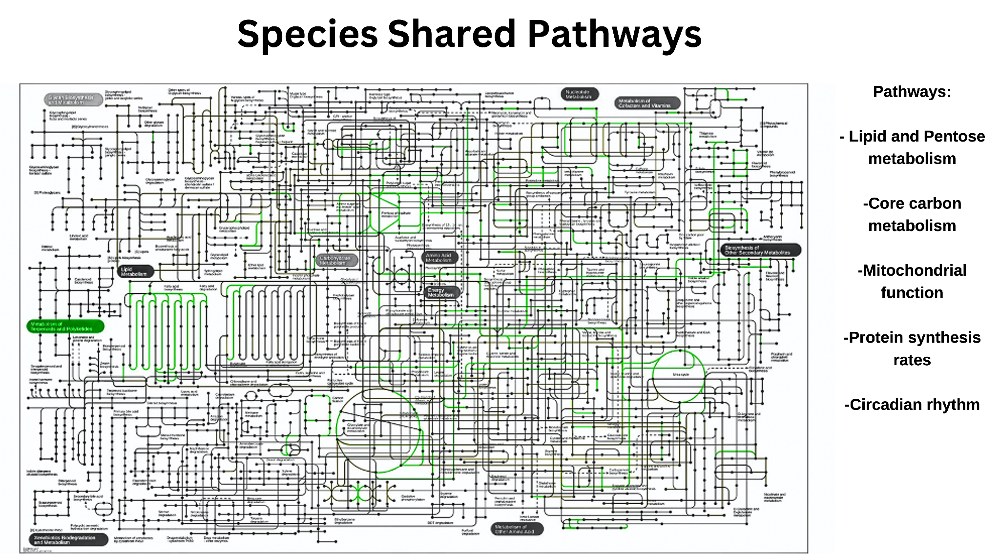

KEGG pathway comparison ideas….

* Montage- 4 ipathgraph, human vs a/d/c. + the combined pathway ?
* Then discuss how the are relative few conserved pathways ?
* Get list from empire-> orthology links for KEGG / mitocarta intersect?
* Reference iPathway3 and KEGG

We encourage you to deposit any step-by-step protocols used in your study in

**Protocol Exchange, an open resource maintained by NPG**.

**Clearly Source data. ->** GeneLab / Open science data system describe in details….

**Statistical information**

Comprehensive information on the statistical analyses used must be included in the paper. The Methods must include a statistics section where you describe the statistical tests used and whether they were one- or two-tailed. Please ensure that the error bars are defined throughout the figures. For all statistics (including error bars), provide the EXACT n values used to calculate the statistics (reporting individual values rather than a range if n varied among experiments). For representative results, report the number of times that the measurements were repeated. Where relevant, provide exact values for both significant and non-significant P values. For ANOVAs, provide F values and degrees of freedom. For t-tests, provide t-values and degrees of freedom. Please specifically define the replicates.

**Github ->** [**https://github.com/Roliepolie/Empire-Matrix-Code**](https://github.com/Roliepolie/Empire-Matrix-Code)

**Zenodo ->** [**https://zenodo.org/deposit?page=1\&size=20**](https://zenodo.org/deposit?page=1\&size=20)

**Clustering**

**Hierarchical**

**PCA**

**K-mean**

**WGNCA**

**Discussion/conclusion**

**Plant**

_**Metascape summary for their function.**_

_**Hypoxia / Acidosis?->... summary?**_

**Fly**

_**Metascape summary for their function.**_

_**Circadian rhythm?->... summary?**_

_**Mouse**_

_**Metascape summary for their function.**_

_**Cancer?->... summary?**_

**Human**

_**Metascape summary for their function.**_

_**Neurological decay?->... summary?**_

#### Estimating Food Requirements for Mars Mission

To accurately estimate the food requirements for a Mars mission, various factors must be considered:

* **Caloric Needs**: Individual energy requirements vary based on age, gender, weight, and activity level, making it essential to calculate the caloric needs for each crew member.
* **Crew Size**: The total number of crew members directly influences the quantity of food required, as a larger crew will necessitate a greater food supply.
* **Mission Duration**: The length of the mission dictates the total amount of food needed. Longer missions require more extensive food planning to ensure adequate supplies throughout.

#### Crew Nutritional Requirements

Ensuring the health of the crew requires careful consideration of their diverse nutritional needs. This involves planning for adequate intake of:

* **Macronutrients:** Essential for energy and body function, including proteins, fats, and carbohydrates.
* **Micronutrients:** Vital for health and immunity, encompassing a range of vitamins and minerals.

Individual dietary requirements must be addressed to support the crew's well-being throughout the mission.

#### Food Storage and Preservation Techniques

Effective food storage and preservation techniques are essential for maintaining the freshness, taste, and nutritional value of various foods. Different foods have unique shelf lives and require specific storage conditions. Understanding these requirements is crucial in reducing waste and ensuring safety.

#### Food Preparation and Serving Considerations

The quantity of food required for a Mars team also hinges on the preparation and serving methods. Different foods demand different levels of preparation, impacting the overall food quantity needed. By evaluating these aspects, it's feasible to calculate the accurate food supply required for the journey.

<figure>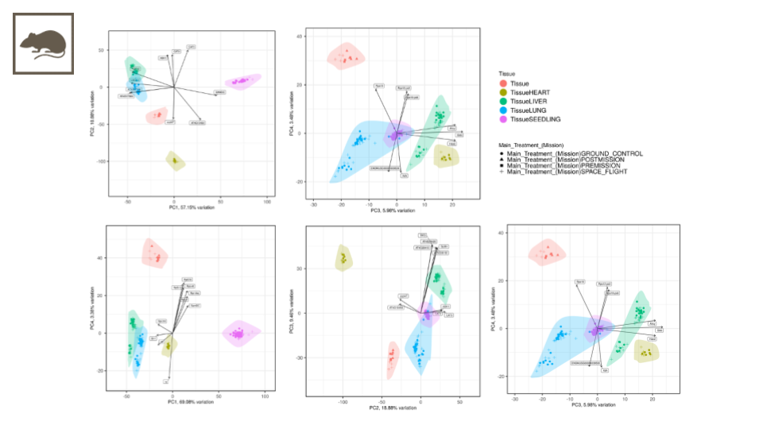<figcaption></figcaption></figure>

<figure>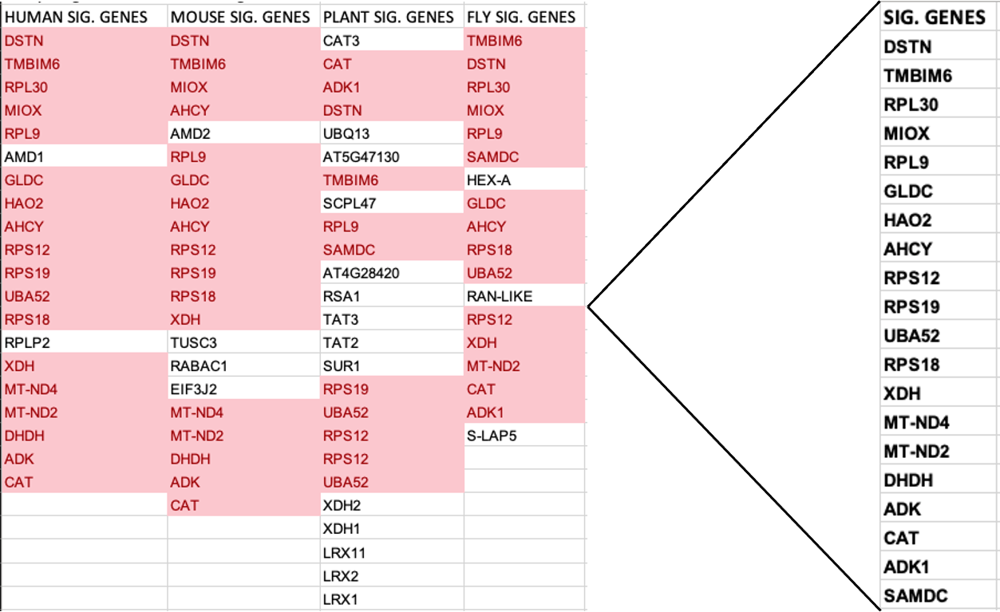<figcaption></figcaption></figure>

The interpretability of the methods used for obtaining significant genes is endless. With our data and comparisons involving multiple factors for significant genes, PCA plots were utilized (fig n) for a holistic set of significant genes based on multiple factors. The inherent nature of PCA plots grouping indicates similarities in genes. With the factors matrix that was created, we can manipulate which factors are considered in the comparison. With a combined species matrix, there are orthogonal genes within the studies that may group together unless Species type is a factor we compare, which is available in the factors matrix. However, we were more concerned with orthologs affected in spaceflight. Analysis of the four different orthologous species matrices helped to identify and solidify the orthologous significant genes across species (fig n). Repeating orthologous within different orthologous species matrices were recorded and a final list was created of the significant genes identified based on tissues and gravitational factor. The resulting genes and their functions (fig n) aligned with the species shared pathways found in iPath3 (fig n).

To find the orthologous genes dysregulated in space flight within the pre existing literature, scientists would have to go through each individual species and study and put the data into a program that had the capabilities to run multiple analyses at once. We have already done this and created the code to allow anyone curious to simply copy the code into R and create matrices that can be analyzed to come up with a list of significant genes based on their species or studies of interest. This saves an innumerable amount of time data mining. Scientists can now focus on creating studies that explore orthologous genes that are dysregulated in spaceflight rather than exploring which genes are dysregulated. This method greatly expands our understanding of orthologous gene regulation in spaceflight as well as how future studies can relate to other organisms outside their selected species. This allows a larger picture to be created of the overall patterns of genes both within a species as well as across multiple species and gives us greater power into understanding and exploring spaceflights influences of gene regulatio**n.**

Dysregulation of mitochondrial function was the greatest reoccurring factor within the final list of significant genes (fig n). The effect mitochondrial function has on lipid and pentose metabolism, core carbon metabolism, protein synthesis rates, and circadian rhythm cannot be ignored and indeed, the data does suggest mitochondrial function is a precursor in the dysregulation of other process in microgravity. Microgravity, whether real or simulated, has a significant impact on mitochondrial size, structure, content, oxygen consumption, and respiratory capacity that causes an apoptotic response in cells (Madder). The data pulled from our research however suggests that mitochondrial response to microgravity causes the dysregulation of the shared pathways across multiple kingdoms. This could be from the reduction in ATP levels associated with mitochondria exposed to microgravity (Madder).

This review demonstrates that weightlessness, whether actual or simulated, has significant effects on mitochondrial functions, which can lead to notable adaptive changes or to an apoptotic response in cells. In general, studies have suggested that mitochondria undergo a reduction in size when exposed to microgravity. After a period of time, restructuring of the cytoskeleton disrupts the mitochondrial structure, thereby reducing mitochondrial content, oxygen consumption, and respiratory capacity. However, scientists in this field still lack sufficient data or information to determine whether real microgravity, especially in deep space, causes mitochondrial stress in the same way as observed on Earth. Scientists are now more focused on space medicines that can prevent and/or relieve space stress. Thus, this review will contribute to a better understanding of the mechanisms involved in mitochondrial dysfunctions during prolonged exposure to microgravity, which will help researchers design appropriate precautions and contingencies to cope with space-related health issues.

To test whether the combined species matrices would be a functional tool for understanding and analyzing specific species, we did further analysis to compare the significant genes of interest with one mouse study as well as the combined mouse matrix and compared the findings with the results of the combined species matrices.

<figure>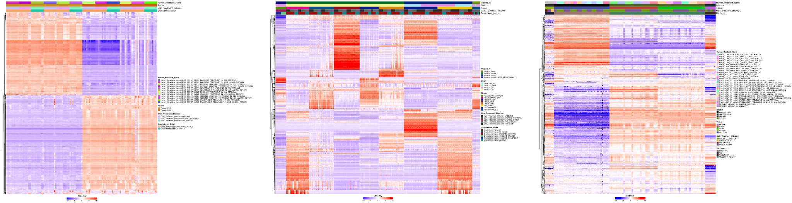<figcaption></figcaption></figure>

The analysis of heat graphs indicates that gene upregulation and downregulation are primarily associated with tissue type. Although this method is not without flaws or biases, it serves as a promising foundation for identifying significantly dysregulated genes in microgravity environments. This approach offers insights into the orthologous impacts of microgravity across various biological kingdoms.

**GeneLab accession and metadata**

**Table 1: Human**

| **Accession** | **Version** | **Project Type**       | **Study Factor Type**                                  | **Study Assay Measurement Type** | **Material Type**                        | **Study Assay Technology Type** |
| ------------- | ----------- | ---------------------- | ------------------------------------------------------ | -------------------------------- | ---------------------------------------- | ------------------------------- |
| OSD-127       | 7           | Ground Study           | Weightlessness Simulation                              | transcription profiling          | cardiac progenitors                      | RNA Sequencing (RNA-Seq)        |
| OSD-124       | 5           | Ground Study           | Electromagnetic Fields                                 | transcription profiling          | mesenchymal stem cell of the bone marrow | DNA microarray                  |
| OSD-125       | 2           | Ground Study           | Weightlessness Simulation, cell line                   | transcription profiling          | tumor cells                              | DNA microarray                  |
| OSD-154       | 3           | Ground Study           | Ionizing Radiation, cell line, Absorbed radiation dose | transcription profiling          | lymphoblastoid cells                     | DNA microarray                  |
| OSD-188       | 4           | Parabolic Flight Study | Altered gravity                                        | transcription profiling          | T cells                                  | DNA microarray                  |
| OSD-71        | 4           | Ground Study           | Ionizing Radiation, Absorbed radiation dose            | transcription profiling          | blood, isolated leukocytes               | DNA microarray                  |
| OSD-78        | 5           | Ground Study           | Ionizing Radiation, treatment                          | transcription profiling          | mammary epithelial cells                 | DNA microarray                  |
| OSD-91        | 4           | Ground Study           | Weightlessness Simulation                              | transcription profiling          | lymphoblastoid cells                     | RNA Sequencing (RNA-Seq)        |
| OSD-530       | 1           | Spaceflight Study      | Spaceflight, time                                      | transcription profiling          | Blood                                    | RNA Sequencing (RNA-Seq)        |

**Table 2: FLY**

| **Accession** | **Version** | **Project Type**  | **Study Factor Type**      | **Study Assay Measurement Type**                     | **Material Type** | **Study Assay Technology Type**             |
| ------------- | ----------- | ----------------- | -------------------------- | ---------------------------------------------------- | ----------------- | ------------------------------------------- |
| OSD-207       | 4           | Spaceflight Study | Space Flight, genotype     | transcription profiling, Protein Expession profiling | Head              | RNA Sequencing (RNA-Seq), mass spectrometry |
| OSD-347       | 3           | Spaceflight Study | Space Flight, Genotype     | transcription profiling                              | Heart             | RNA Sequencing (RNA-Seq)                    |
| OSD-514       | 2           | Spaceflight Study | Sex, Space Flight, Gravity | transcription profiling, Protein Expession profiling | Brain             | RNA Sequencing (RNA-Seq), mass spectrometry |
| OSD-85        | 7           | Ground Study      | Hypergravity               | transcription profiling                              | Total\_RNA        | RNA Sequencing (RNA-Seq)                    |

**Table 3: Mouse**

| **Accession** | **Version** | **Project Type**  | **Study Factor Type**                                   | **Study Assay Measurement Type** | **Material Type** | **Study Assay Technology Type** |
| ------------- | ----------- | ----------------- | ------------------------------------------------------- | -------------------------------- | ----------------- | ------------------------------- |
| OSD-214       | 5           | Ground Study      | Hindlimb Suspension, vaccine adjuvant, Tetanus Toxoid   | transcription profiling          | Bone Marrow       | RNA Sequencing (RNA-Seq)        |
| OSD-243       | 12          | Spaceflight Study | Space Flight, duration, dissection, Euthanasia, Animal  | transcription profiling          | dorsal skin       | RNA Sequencing (RNA-Seq)        |
| OSD-244       | 12          | Spaceflight Study | Space Flight, duration, dissection, Euthanasia Location | transcription profiling          | Thymus            | RNA Sequencing (RNA-Seq)        |
| OSD-245       | 14          | Spaceflight Study | Space Flight, duration, dissection, Euthanasia Location | transcription profiling          | liver             | RNA Sequencing (RNA-Seq)        |
| OSD-246       | 12          | Spaceflight Study | Space Flight, duration, dissection, Euthanasia Location | transcription profiling          | spleen            | RNA Sequencing (RNA-Seq)        |
| OSD-248       | 11          | Spaceflight Study | Space Flight, duration, dissection, Euthanasia Location | transcription profiling          | left lung lobe    | RNA Sequencing (RNA-Seq)        |
| OSD-253       | 8           | Spaceflight Study | Space Flight strain duration                            | transcription profiling          | left kidney       | RNA Sequencing (RNA-Seq)        |
| OSD-254       | 13          | Spaceflight Study | Space Flight strain duration                            | transcription profiling          | dorsal skin       | RNA Sequencing (RNA-Seq)        |
| OSD-289       | 5           | Spaceflight Study | Experiment, Space Flight, Gravity Altered               | transcription profiling          | Thymus Gland      | RNA Sequencing (RNA-Seq)        |

**Table 4: Arabidopsis Barker et al., (under review)**

| **Accession** | **Version** | **Project Type**  | **Study Factor Type**                    | **Study Assay Measurement Type**                      | **Material Type** | **Study Assay Technology Type**                |
| ------------- | ----------- | ----------------- | ---------------------------------------- | ----------------------------------------------------- | ----------------- | ---------------------------------------------- |
| OSD-120       | 16          | Spaceflight Study | Ecotype, Spacflight, treatment           | transcription profiling                               | Root              | RNA Sequencing (RNA-Seq)                       |
| OSD-208       | 9           | Ground Study      | Treatment                                | transcription profiling                               | Root              | RNA Sequencing (RNA-Seq), DNA Microarray       |
| OSD-217       | 2           | Spaceflight Study | Spaceflight, Organism part               | DNA methylation profiling, transcription profiling    | Root, Leaf        | Bisulfite sequencing, RNA Sequencing (RNA-Seq) |
| OSD-251       | 13          | Spaceflight Study | Altered gravity, Spaceflight             | transcription profiling                               | Seedling          | RNA Sequencing (RNA-Seq)                       |
| OSD-314       | 4           | Spaceflight Study | Altered gravity, Light, Spaceflight,     | transcription profiling                               | Seedling          | RNA Sequencing (RNA-Seq)                       |
| OSD-37        | 11          | Spaceflight Study | Ecotype, Spaceflight,                    | transcription profiling                               | Seedling          | RNA Sequencing (RNA-Seq)                       |
| OSD-38        | 12          | Spaceflight Study | Sample preservation method, Spaceflight, | transcription profiling; protein expression profiling | Seedling          | RNA Sequencing (RNA-Seq); mass spectrometry    |
| OSD-476       | 1           | Ground Study      | Treatment                                | transcription profiling; Morphometric analysis        | Leaf              | RNA Sequencing (RNA-Seq); Image Sequencing     |

## &#x20;

## Results 

### Mouse -> Organ’s -> uG 

**3 organs specific clusters**

<figure>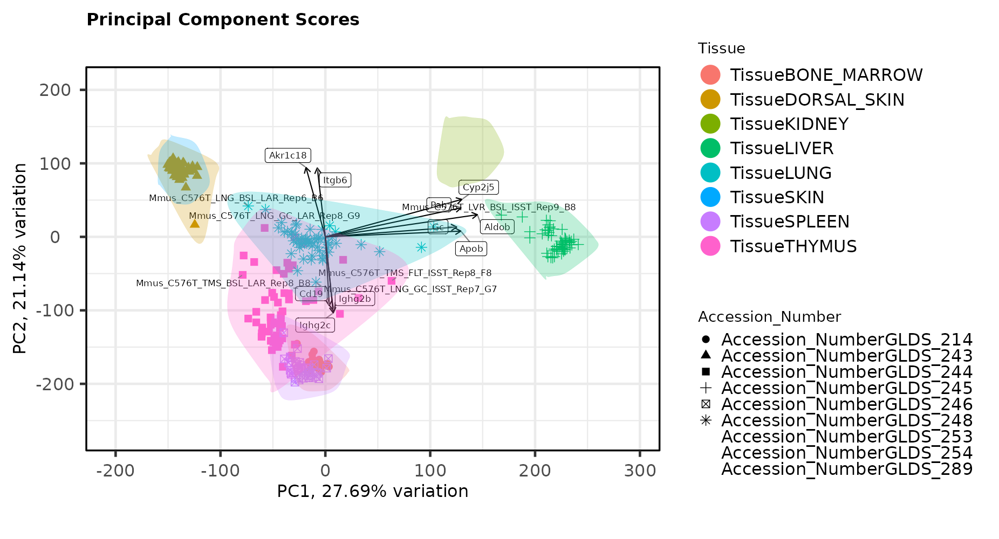<figcaption></figcaption></figure>

<figure>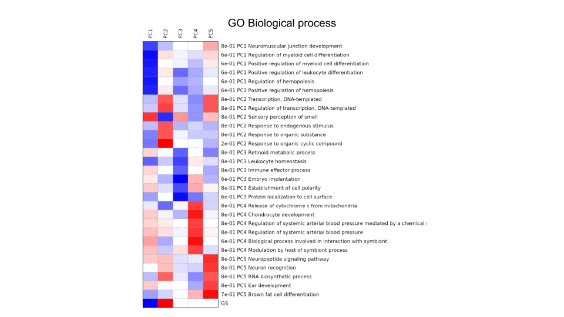<figcaption></figcaption></figure>

**Figure X: Calculated using XXX OSD-xx**

_**3 Groups of genes on the PCA vectors.**_

**Note: What is the Gene ID? -> **_**Ensembl gene ID, or gene name? Or ref seq ID?**_

_**Group1**_

#### Gene Expression Analysis

This document details the gene expression levels across two distinct groups: Group 3 and Group 2. The genes under observation are primarily focused on immunoglobulins, cell surface receptors, and enzymes involved in metabolic processes.

**Group 3: Enhanced Immune Response Genes**

* **Ighg2c**: Immunoglobulin Heavy Constant Gamma 2C (Expression: 2278)
* **Ighg2b**: Immunoglobulin Heavy Constant Gamma 2B (Expression: 6607)
* **Cd19**: CD19 Molecule (Expression: 2615)
* **Pab**: Not fully identified, presumed Antibody related (Expression: 10070)
* **Gc**: Vitamin D Binding Protein (Expression: Unknown)
* **Apob**: Apolipoprotein B (Expression: Unknown)
* **Aldob**: Aldolase, Fructose-Bisphosphate B (Expression: Unknown)
* **Cyp2j5**: Cytochrome P450, Family 2, Subfamily J, Polypeptide 5 (Expression: Unknown)

**Group 2: Cellular Adhesion and Metabolism**

* **Itgb6**: Integrin Subunit Beta 6 (Expression: Unknown)
* **Akr1c18**: Aldo-Keto Reductase Family 1, Member C18 (Expression: Unknown)

The document summarizes expression levels where available and notes the absence of data for certain genes. This analysis is crucial for understanding the differential expression that indicates an enhanced immune response in Group 3 compared to the metabolic and cellular adhesion pathways predominantly observed in Group 2. Further research and data collection are needed for a comprehensive understanding of these expression patterns.

### Plant -> Organ -> light -> uG 

<figure>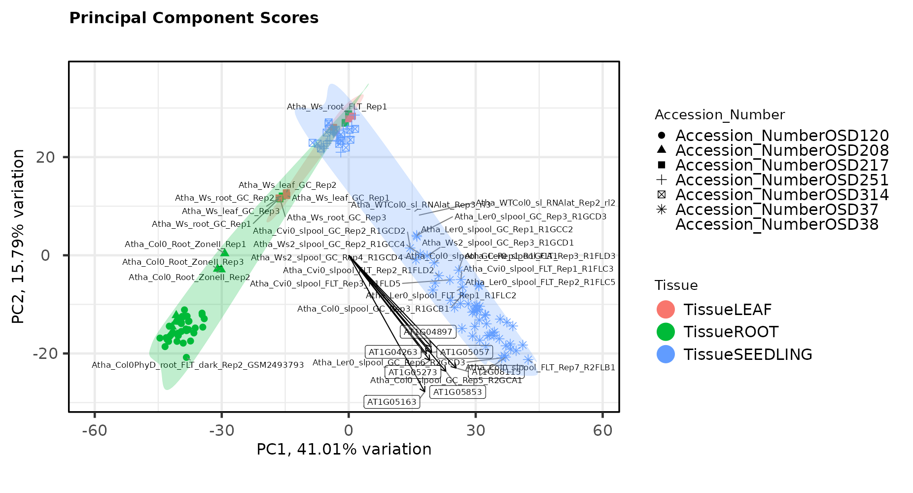<figcaption></figcaption></figure>

<figure>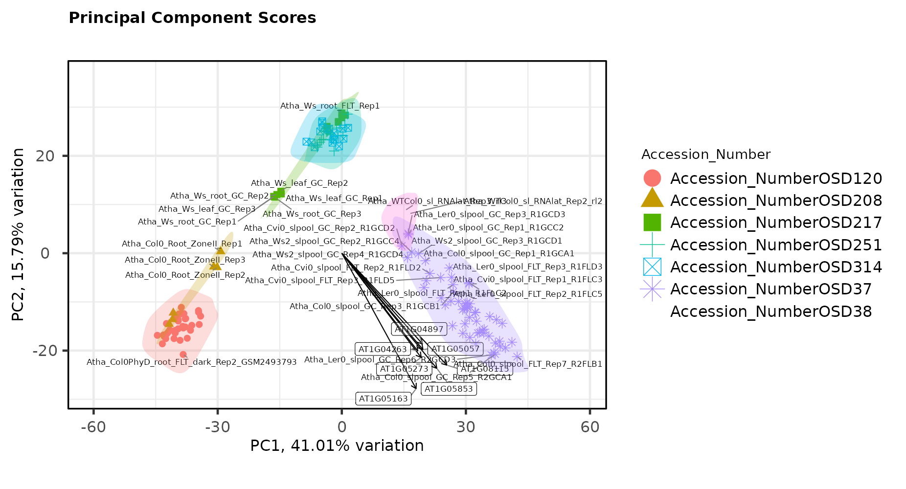<figcaption></figcaption></figure>

_**PCA plot -> with Gene List -> 3D PCA showed 3 clusters**_

<figure>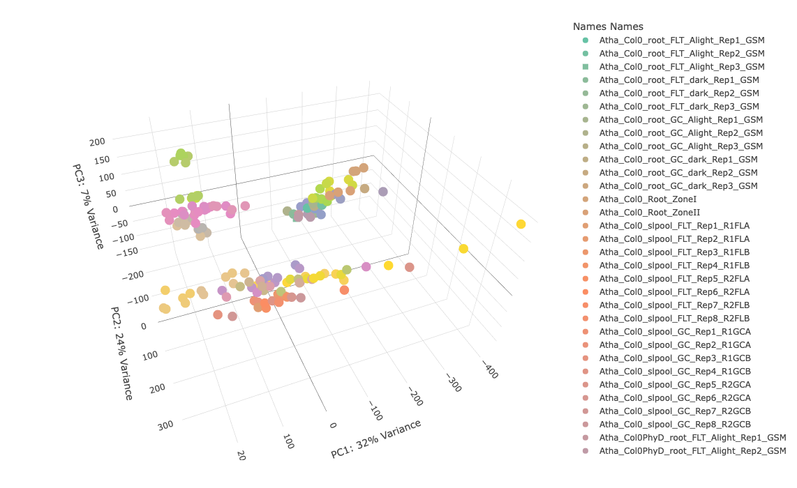<figcaption></figcaption></figure>

**Figure XX:** 3D PCR clustering identifies 3 main groups.&#x20;

<figure>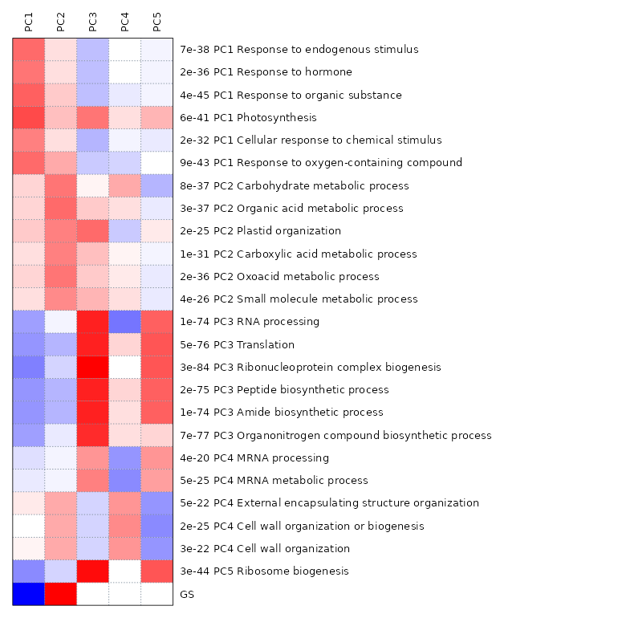<figcaption></figcaption></figure>

**Figure XX: Plant RNAseq Matrix Go Biological process**

### Fly -> Heart -> uG 

**\_>** [**Link to Google slides show of figures**](https://docs.google.com/presentation/d/1D91IgPmRfGC7FfXhv4FFPKZ0L2PnHjfR7ipgJEVgExo/edit?usp=sharing)

<figure>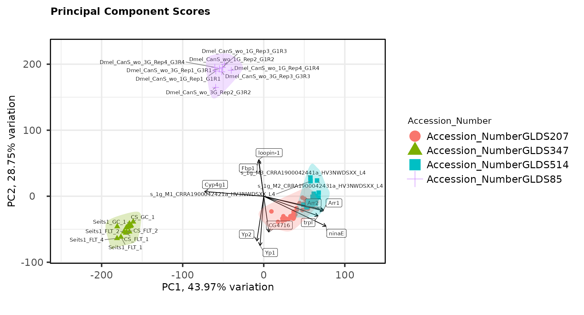<figcaption></figcaption></figure>

<figure>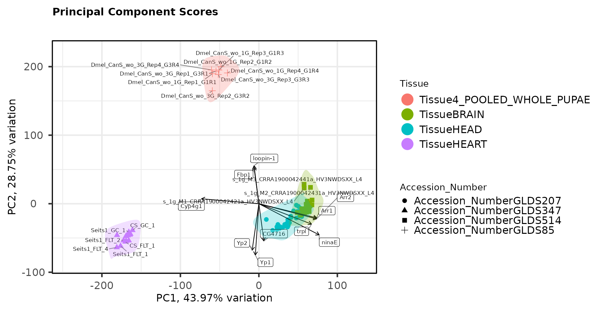<figcaption></figcaption></figure>

_**Gene List from the PCA correlation graph -> Loopin-1, Fbp1, Cyp4g1, Yp2, Yp1, CG4716, trpl, Arr1, Arr2, ninaE**_

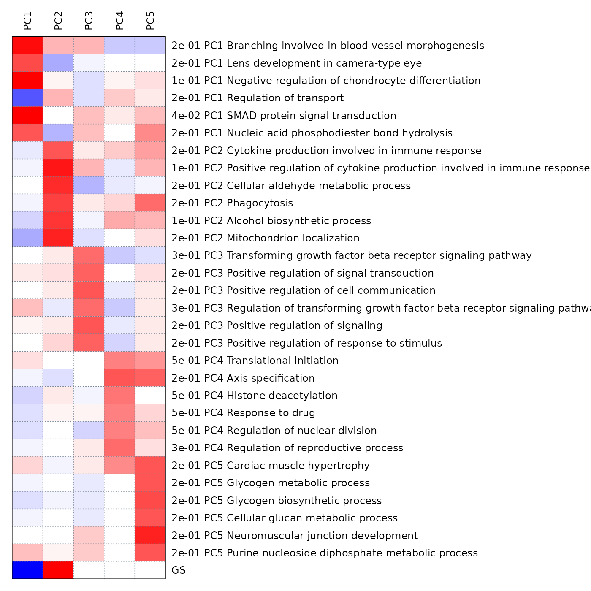

**Figure XXX: Fruit fly RNAseq Matrix Go Biological process**

_**4 Groups of genes on the PCA vectors.**_

_**Group 1:**_

**Loopin-1**

**Fbp1**

_**Group 2:**_

**Arr2**

**Arr1**

**Trpl**

**ninaE**

_**Group 3:**_

**CG4716**

**Yp1**

**Yp2**

_**Group 4:**_

**Cyp4g1**

### Human -> uG vs Simulated microgravity 

<figure>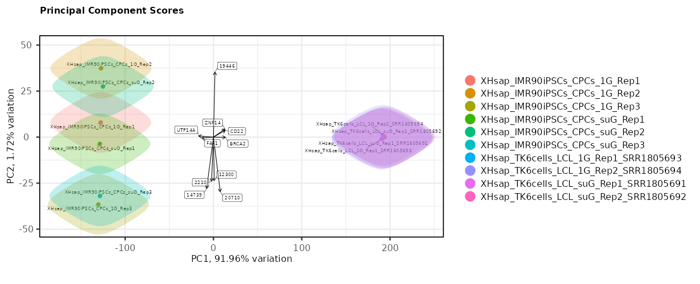<figcaption></figcaption></figure>

<figure>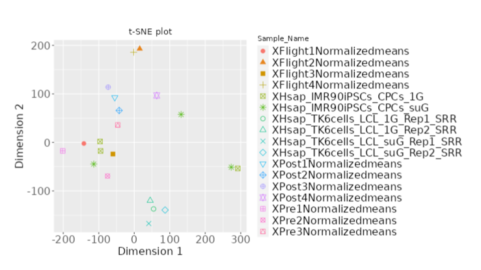<figcaption></figcaption></figure>

<figure>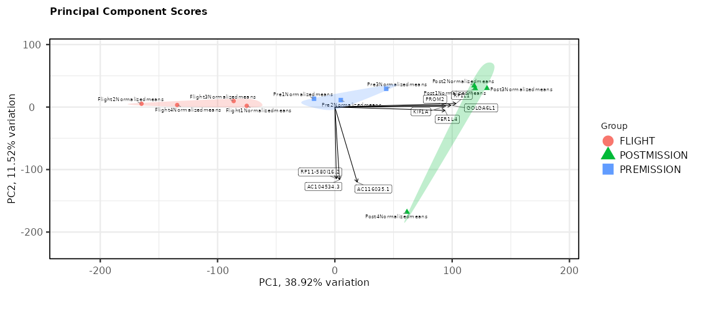<figcaption></figcaption></figure>

**Is there’s version with Jaxa and cells combined?**

_**Figure XX: JAXA & OSD-127 and OSD-91. PCA plot -> with Gene List.**_ ZNF14, UTP14A, FAF1, CD22, BRCA2

<figure>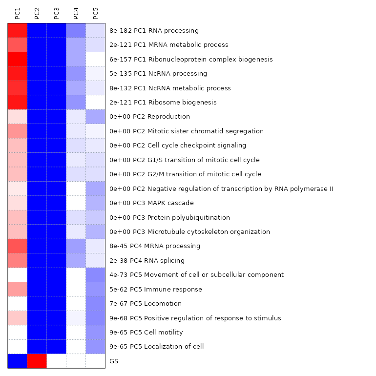<figcaption></figcaption></figure>

**Figure XX: Human RNAseq Matrix Go Biological process, this **_**contains 2 simulated microgravity OSD accession -> JAXA OSD-530 & OSD-127 and OSD-91**_

<figure>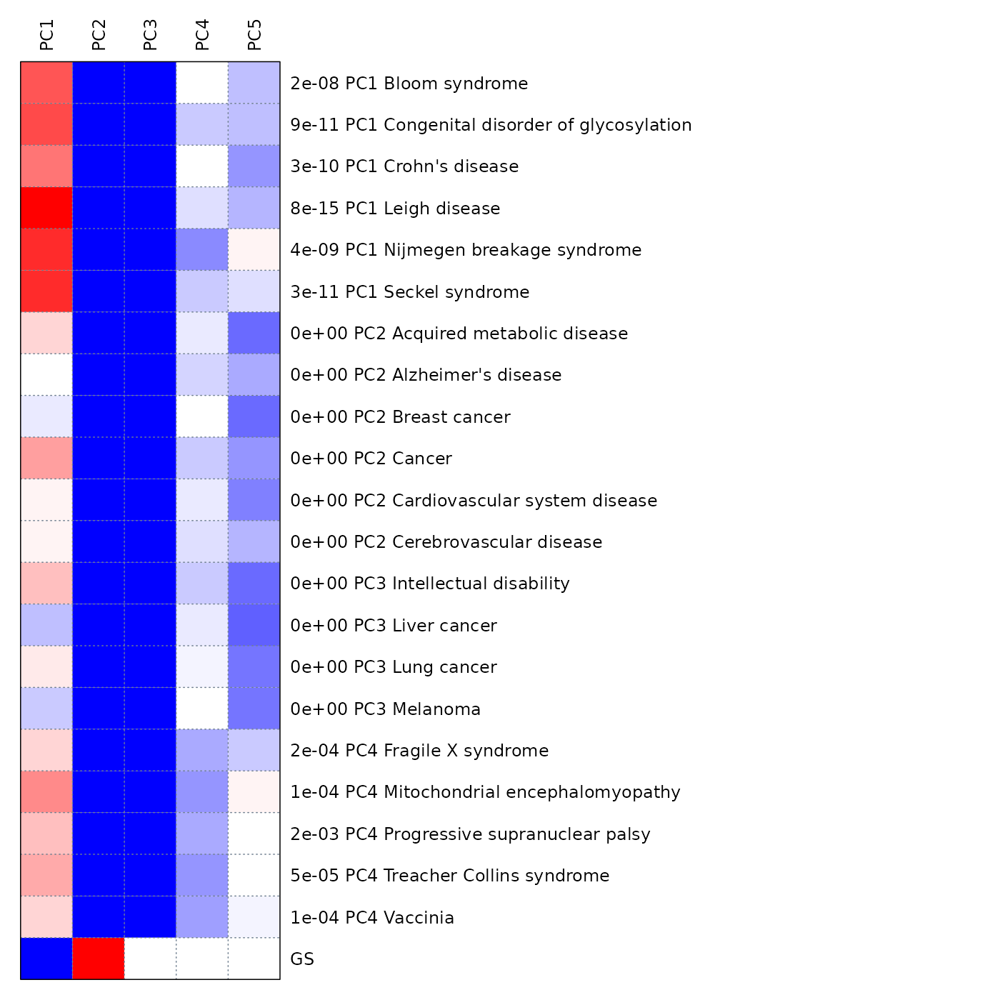<figcaption></figcaption></figure>

**Figure XX: Human RNA seq Jensen.Diseases**

<figure>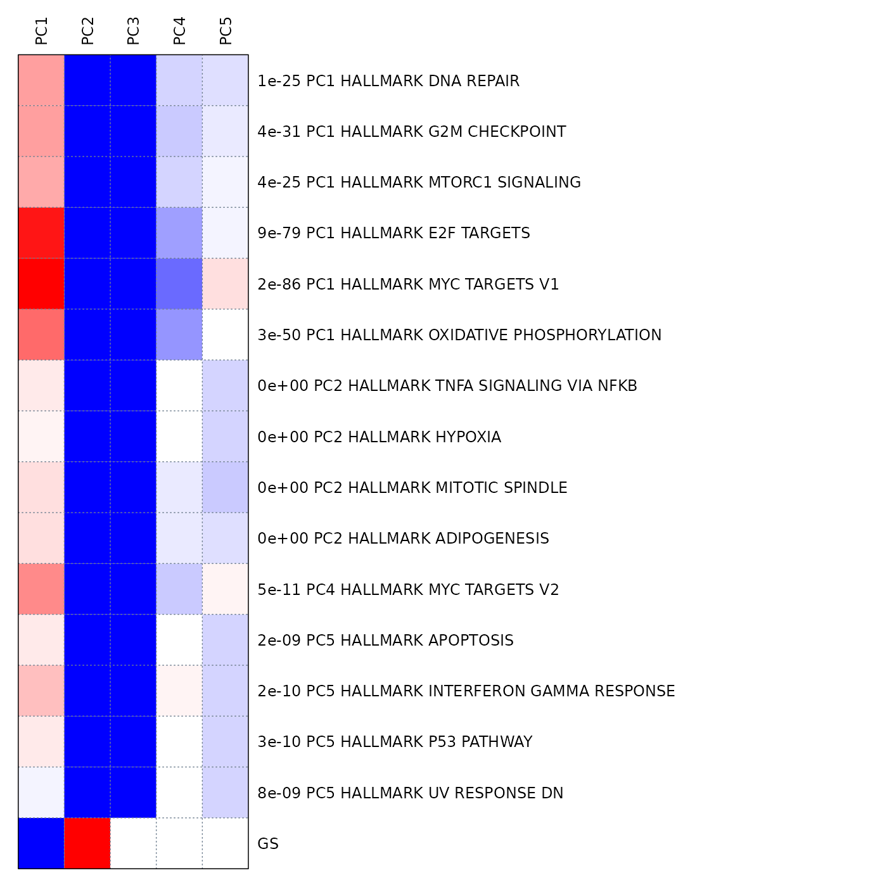<figcaption></figcaption></figure>

**Figure XX: Human RNA seq** Hallmark.msigdb

PC2 and PC3 mitochondrial response to hypoxia&#x20;

<figure><figcaption></figcaption></figure>

_**4 Groups of genes on the PCA vectors.**_

_**Group 1:**_

**19446**

_**Group 2:**_

**ZNF14 - Zinc finger protein**

**CD22 - K06569 melanoma-associated antigen p97 | (RefSeq) MELTF, CD228, MAP97, MFI2, MTF1, MTf; melanotransferrin; CD22 antigen | (RefSeq) CD22, SIGLEC-2, SIGLEC2; CD22 molecule;**

**BRCA2**

_**Group 3:**_

**12300**

**20710**

**14739**

**2210**

_**Group 4:**_

**FAF1 - NDUFAF1, CIA30; NADH dehydrogenase \[ubiquinone] 1 alpha subcomplex assembly factor 1**

**UTP14A - K14567 U3 small nucleolar RNA-associated protein 14 | (RefSeq) UTP14A, NYCO16, SDCCAG16, Utp14, dJ537K23.3; UTP14A small subunit processome component.**

**Drilling down into the JAXA astronaut data reveals core mitochondrial response.**

<figure>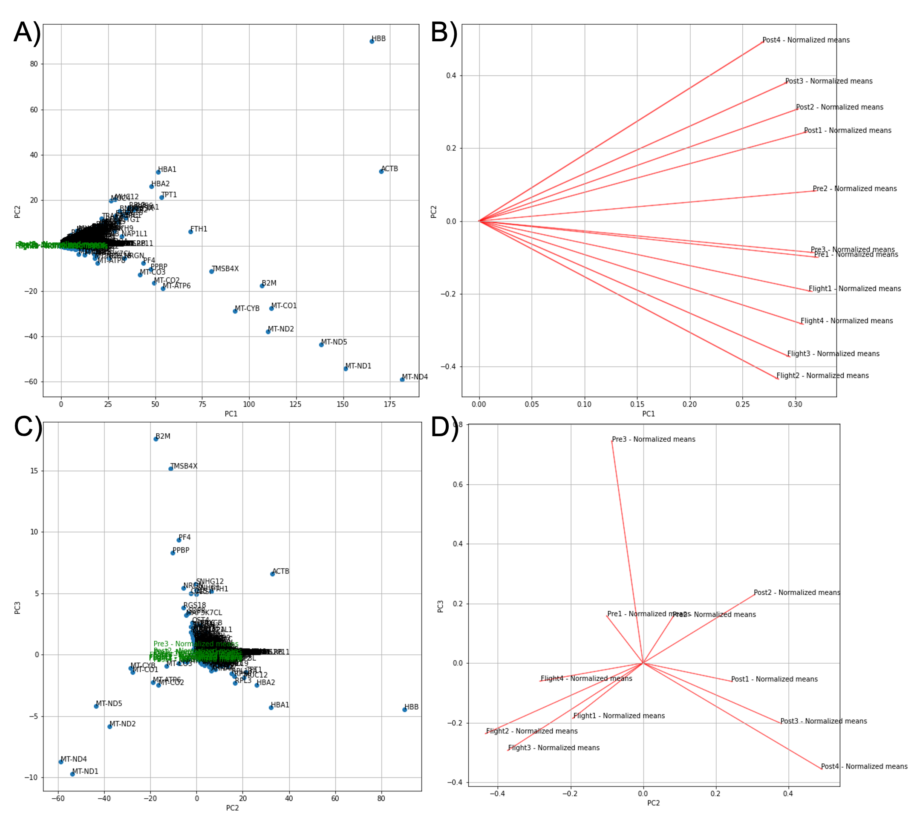<figcaption></figcaption></figure>

**Gene PCA Plots of PC1 vs. PC2 (A\&B) and PC2 vs. PC3 (C\&D)**

PCA revealed preferential clustering of mitochondrial genes from the mitochondrially encoded NADH dehydrogenase family (_MT-ND_), mitochondrially encoded cytochrome C oxidase family (MT-CO), and both mitochondrially encoded ATP synthase membrane subunits (MT-ATP6 & 8) along the flight sample axis in PC1, 2, and 3.

**Abbreviated Expression Heatmap of Top 100 Genes by Distance From Origin**

_Shows Cluster 1 from Top Level Hierarchical Clustering._ Mitochondrial encoded genes are hierarchically clustered together (Morpheus Hierarchical Clustering Tool) and show increased expression during spaceflight and repressed expression post-space flight when compared to the preflight samples (no statistics, just looks like this so far). This same pattern is roughly seen in a series of other genes. The approach may be biased by read count: TOP 100 genes by distance about the origin vs the TOP 100 genes by sum of row value.

**JAXA6 true mission response associations**

<figure>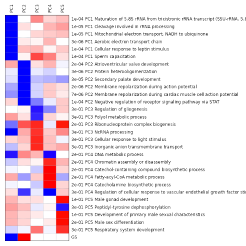<figcaption></figcaption></figure>

**Figure XXX: Human RNAseq Matrix Go Biological process, this **_**using just -> JAXA6 OSD-530**_

PCA Plots

<figure><figcaption></figcaption></figure>

**Figure XXXX:** iPath3 visualization of total possible metabolism space based on KEGG. Red lines show biochemical reactions that are conserved across Human, Arabidopsis, Mouse and Fruit fly species. GEGC network analysis identified 9 interaction clusters. Mitochondria diagram with integrated vitamin and mineral ion labeling highlighting their role integrating and facilitating carbohydrate, lipid, and nucleic acid metabolism.

**Source:** [**https://pathways.embl.de**](https://pathways.embl.de/)

**Supplementary Table:** KEGG KO reaction ID list for each model organism, Human, Mouse, Fruit fly and Arabidopsis.

**Figure XXX: Heat map showing conserved primary carbon metabolism.**

<figure><figcaption></figcaption></figure>

<figure><figcaption></figcaption></figure>

**References**

NC allow \~<= 70 references.

1\. Ge, Son & Yao, iDEP, [BMC Bioinformatics 19:1-24, 2018.](https://bmcbioinformatics.biomedcentral.com/articles/10.1186/s12859-018-2486-6)

**WGCNA?**

[https://bmcbioinformatics.biomedcentral.com/articles/10.1186/1471-2105-9-559](https://bmcbioinformatics.biomedcentral.com/articles/10.1186/1471-2105-9-559)

Work out reference type for NC & work out how to optimse use of your Medela library in order to select \~20 references for the introduction….

**Tables.** Each table should be prepared using the Table menu in Word or the table environment in TeX/LaTeX and accompanied by a short title sentence describing what the table shows. Further details can be included as footnotes to the table.

**Figures:** High-resolution image files are not required at initial submission, but please ensure that images are of sufficient resolution for referees to properly assess the data.

### **Data Availability** 

The RNA-seq data are available via the NASA Open Science Data Repository’s (OSDR)’s Biological Data Management Environment ([https://osdr.nasa.gov/bio/repo](https://osdr.nasa.gov/bio/repo)) with accession IDs: OSD-XX….

### **Acknowledgments** 

**Acknowledgements (optional)**. _Keep acknowledgements brief and do not include thanks to anonymous referees or editors, or effusive comments. Grant or contribution numbers may be acknowledged._

### **Author contributions** 

**Author contributions**. You must include a statement that specifies the individual contributions of each co-author. For example: "A.P.M. ‘contributed’ Y and Z; B.T.R. ‘contributed’ Y,” etc. See our authorship policies for more details. Competing interests. Submission of a competing interests statement is required for all content of the journal. Materials & Correspondence. Indicate the author(s) to whom correspondence and material requests should be addressed.

No competing interest.
